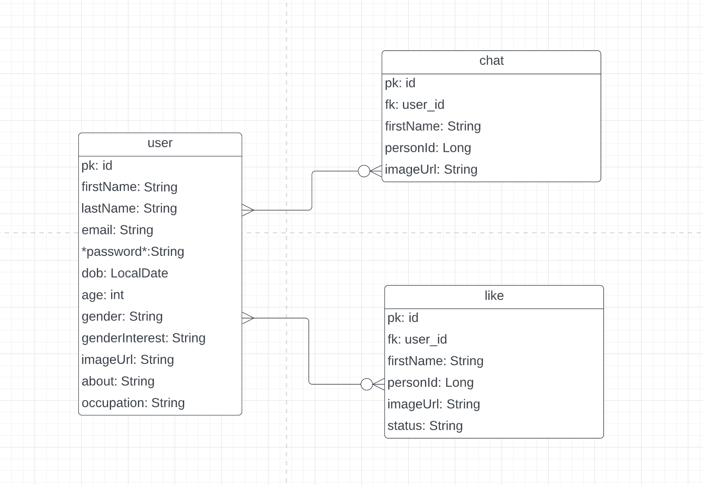
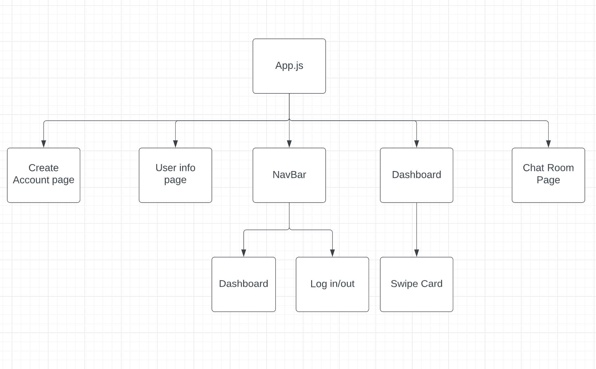

# Project : LetsChat

### Data: 9/1/2022

### By: Carolyn Chien

[Github](https://github.com/Carolynchien) |
[Linkedin](https://www.linkedin.com/in/yin-ting-chien-6a14b8161/)

---

## _*Description*_

This is a online chat app allows users to communicate in real-time.
users are able to share description of themself, uplaading pictures
possbilly to find or get suggestions on people that share the same intestes with.

---

## _*Technology Used*_

- Java
- Spring Boot
- Socket.IO
- Javascript
- CSS
- React

---

## _*ERD*_

---

## _*Component Hierarchy Diagram*_

---

## _*POSTMVP*_

Create a function to be able to retrive history of message.

---
